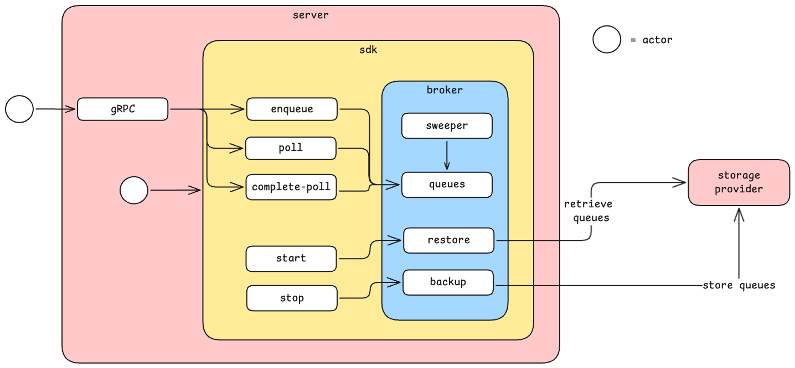

# broker

This is an attempt to create a modular message-broker using golang. The modularity: 
1. by running the broker as an domain which can be part of an existing service/monolith/microservice
2. by running the broker as a stand alone message broker which can exposed using gRPC
3. giving option back to user to specify storage/persistence they want to use for backup/restore during downtime/deployment

## structure

## flow

### enqueue
enqueue a message into a queue

### poll
poll a message from a queue

### complete-poll
completes an active/polled message journey

### sweeper
check for expiring message and put them back into the queue. `sweeper` will run in the background concurrently and currently set to run every 1 second

